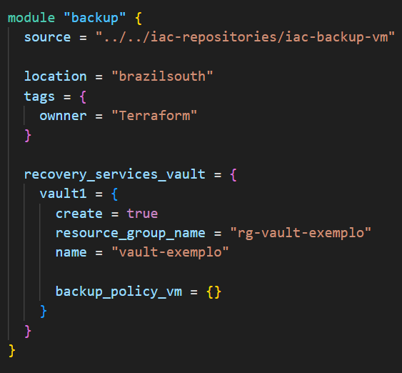
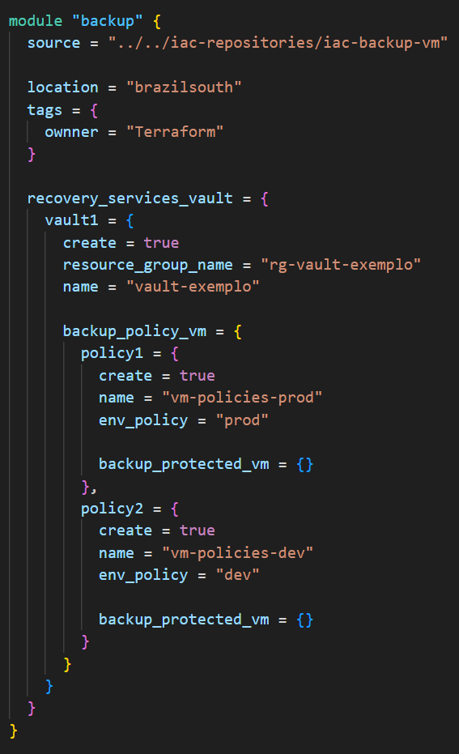
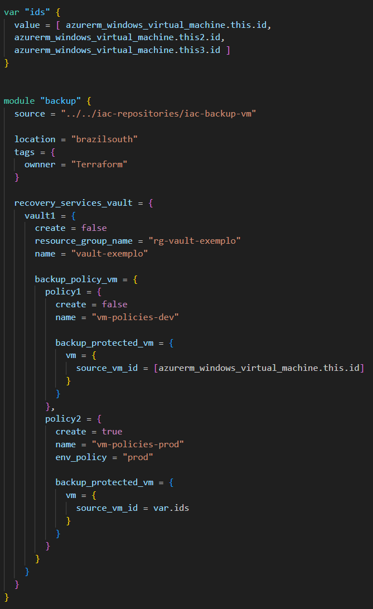

# Recursos
Este módulo se relaciona com os recursos da Azure abaixo:

  | Recurso | Documentação Terraform | Versão do Provider |
  | - | - | :-: |
  |[Recovery Services Vault](https://learn.microsoft.com/en-us/azure/backup/backup-azure-recovery-services-vault-overview "Microsoft Learn") | [azurerm_recovery_services_vault] (https://registry.terraform.io/providers/hashicorp/azurerm/latest/docs/resources/recovery_services_vault.html "Registry Terraform") | **>= 3.6** |
  |[Políticas de Backup para VM](https://learn.microsoft.com/en-us/azure/backup/backup-azure-vms-enhanced-policy?tabs=azure-portal "Microsoft Learn") | [azurerm_backup_policy_vm] (https://registry.terraform.io/providers/hashicorp/azurerm/latest/docs/resources/backup_policy_vm.html "Registry Terraform") | **>= 3.6** |
  |[Registrar VMs a um Vault](https://learn.microsoft.com/en-us/azure/backup/backup-azure-vms-first-look-arm "Microsoft Learn") | [azurerm_backup_protected_vm] (https://registry.terraform.io/providers/hashicorp/azurerm/latest/docs/resources/backup_protected_vm "Registry Terraform") | **>= 3.6** |

# Abrangência
  ## Este módulo permite:
  
   - Criar um ou mais **Recovery Services Vault** isoladamente (sem politicas e registro de VMs)
   - Criar ou recuperar **Recovery Services Vault** existentes para criação de novas **Políticas de backup para VMs**, registrando ou não VMs a estes recursos;
   - Utilizar **Recovery Services Vault** e **Políticas de backup para VMs** já existentes para registro de VMs.

  ## Este módulo não permite:
   - Criar uma ou mais **Políticas de backup para VMs** sem associá-las a um **Recovery Services Vault** (provider não permite);
   - **Registrar VMs a um Vault** sem informar **Recovery Services Vault** e **Políticas de backup para VMs**, novos ou já existentes (provider não permite).

> **IMPORTANTE**
> 
> \- Até 1000 VMs podem ser registradas em um mesmo vault;
> 
> \- Um mesmo vault suporta até 2000 recursos registrados;
> 
> \- Até 200 políticas podem ser criadas para cada vault.
>
> [FAQ - Recovery Services Vault] (https://learn.microsoft.com/pt-br/azure/backup/backup-azure-backup-faq)
> 
> [FAQ - Backup do Azure VMs] (https://learn.microsoft.com/pt-br/azure/backup/backup-azure-vm-backup-faq)

# Padrão adotado pela Telefônica Vivo em relação a políticas de backup para VMs

Para atender aos padrões de backup para VM na telefônica Vivo, ao criar o recurso **Políticas de backup para VMs** a variável *env_policy* pode ser informada com os valores:
- *"prod"* - para adoção da política vigente de backup para VMs em ambiente de produção.
- *"dev"* - para adoção da política vigente de backup para VMs em ambientes de desenvolvimento e testes.

> Se outro valor for informado na variável ou se a mesma não for declarada, uma política customizada (fora dos padrões Telefônica Vivo), poderá ser criada, porém para isto, algumas variáveis obrigatórias deverão ser informadas, conforme documentação do *provider*. Para verificar todas as variáveis do módulo (obrigatórias e opcionais), consultar a seção Variáveis.
  
# Exemplos de Uso

>As variáveis ilustradas no exemplo são obrigatórias, porém seu conteúdo não equivale a informações reais.
> 
> \* Para informações de todas as variávies do módulo (obrigatórias e opcionais), consultar a seção *Variáveis*.

---

1 - Criar um ou mais **Recovery Services Vault** isoladamente (sem politicas e registro de VMs).

\*A variavel *create* informa se o recurso deve ser criado (*true*) ou se as informações devem ser recuperadas de um recurso existente (*false*).

---
2 - Criar **Políticas de backup para VMs**, não registrando VMs a estes recursos.

\*Os exemplos abaixo utilizam a variável *env_policy*, ou seja, padrões de políticas para backup de VMs adotado na Telefônica Vivo. Para criação de políticas personalizadas, consultar as seção de *Variáveis*.

---
3 - **Registrar VMs a um Vault** já existente, associando a uma **Políticas de backup para VMs** já cadastrada no vault. O exemplo também cria novas **Políticas de backup para VMs** e registra VMs no mesmo vault com as novas políticas.

\* Note que a variável *env_police* não precisa ser informada ao utilizar **Políticas de backup para VMs** já existente (*create=false*), pois esta informação é desconsiderada, uma vez que as políticas foram definidas durante a criação do recurso a ser utilizado.

\*Outro ponto importante é que a variável *source_vm_id* deve receber uma lista de string.

---
# Variáveis

| Nome da Variável | Tipo | Obrigatoriedade |Default | Descrição |
| - | - | - | - | - |
| location | string | Opcional | "brazilsouth" | Região em que os recursos serão criados ou recuperados |
| tags | map(any) | Obrigatória | "idorcamento", "projeto" e "trilha" | Mapa com as tags relacionadas ao recurso principal |
| **recovery_services_vault** | map(object) | Obrigatória | N/A | Mapa de objetos com os argumentos de Recovery Services Vault. Este mapa recebe todas as variáveis abaixo | |
| create | bool | Opcional | false | Informa se o recurso Recovery Services Vault deve ser criado (*true*) ou recuperado (*false*) |
| resource_group_name | string | Obrigatória | N/A | Resource Group onde os recursos (Recovery Services Vault e Políticas de Backup para VMs) já existem ou sertão criados|
| name | string | Obrigatória | N/A | Nome do Recovery Services Vault já existente ou a ser criado |
| sku | string | Opcional | "Standard" | Define o SKU do cofre. Os valores possíveis incluem: "Standard", "RS0" |
| soft_delete_enabled | bool | Opcional | true | A exclusão reversível está habilitada para este cofre |
| public_network_access_enabled | bool | Opcional | false | Está habilitado para acessar o cofre de redes públicas |
| immutability | string | Opcional | "Disabled" | Configurações de imutabilidade do cofre, os valores possíveis incluem: Locked, Unlocked and Disabled |
| storage_mode_type | string | Opcional | "ZoneRedundant" | O tipo de armazenamento do Cofre dos Serviços de Recuperação. Os valores possíveis incluem: "GeoRedundant", "LocallyRedundant" e "ZoneRedundant" |
| cross_region_restore_enabled | bool | Opcional | false | A restauração entre regiões está habilitada para este Vault? Só pode ser verdadeiro quando *storage_mode_type* for "GeoRedundant" |
| classic_vmware_replication_enabled | bool | Opcional | N/A | Se deve habilitar a experiência Classic para replicação VMware. Se definido como falso, as máquinas VMware serão protegidas usando o novo dispositivo de replicação ASR sem estado |
| identity | object | Opcional | N/A | Bloco de variáveis de identity |
| type | string | Obrigatório (quando o bloco *identity* é utilizado) | N/A | Especifica o tipo de Identidade de Serviço Gerenciado que deve ser configurado neste Cofre de Serviços de Recuperação. Os valores possíveis são "SystemAssigned", "UserAssigned", ou "SystemAssigned, UserAssigned" |
| identity_ids | list(string) | Opcional (obrigatório quando *type* for "UserAssigned", ou "SystemAssigned, UserAssigned") | N/A | Uma lista de IDs de identidade gerenciada atribuídas pelo usuário a serem atribuídas a esta configuração de aplicativo. |
| encryption | object | Opcional | N/A | Bloco de variáveis de encryption |
| key_id | string | Obrigatório (quando o bloco *encryption* é utilizado) | N/A | A ID da chave do Key Vault usada para criptografar este cofre. A chave gerenciada pelo Vault Managed Hardware Security Module também é suportada |
| infrastructure_encryption_enabled | bool | Obrigatório (quando o bloco *encryption* é utilizado) | N/A | Habilitando/Desabilitando o estado de Criptografia Dupla |
| user_assigned_identity_id | string | Opcional | N/A | Especifica o ID de identidade designado pelo usuário a ser usado |
| use_system_assigned_identity | bool | Opcional | true | Indique se a identidade atribuída pelo sistema deve ser usada ou não |
| monitoring | object | Opcional | N/A | Bloco de variáveis de monitoring |
| alerts_for_all_job_failures_enabled | bool | Opcional | true | Habilitando/desabilitando alertas internos do Azure Monitor para cenários de segurança e cenários de falha de trabalho |
| alerts_for_critical_operation_failures_enabled | bool | Opcional | true | Ativar/desativar alertas da solução mais antiga (alertas clássicos) |
| **backup_policy_vm** | map(object) | Obrigatório (para não utiliza-lo, atribua o valor {}) | N/A | Mapa de objetos com os argumentos de Políticas de Backup para VMs. Este mapa recebe todas as variáveis abaixo |
| create | bool | Opcional | false | Informa se o recurso *backup_policy_vm* deve ser criado (*true*) ou recuperado (*false*) |
| name | string | Obrigatória | N/A | Nome dado ao conjunto de políticas já existente ou a ser criado |
| env_policy | string | Opcional | null | Variável para indicar o padrão de políticas de backup para VMs da Vivo. Valor "prod" aplica o padrão de produção, já o valor "dev" aplica o padrão dos ambientes de desenvolvimento e testes. Caso a variável não seja declarada ou receba um valor diferente, nenhum padrão será aplicado e a customização deve ser informada |
| policy_type | string | opcional | "V2" | Tipo da política de backup. Os valores possíveis são V1 e V2, onde V2 representa a Política Aprimorada |
| timezone | string | Opcional | "E. South America Standard Time" | [Especifica o fuso horário](https://jackstromberg.com/2017/01/list-of-time-zones-consumed-by-azure/) |
| instant_restore_retention_days | number | Opcional | N/A | Especifica o intervalo de retenção da restauração instantânea em dias. Os valores possíveis estão entre 1 e 5 quando policy_type for V1 e 1 a 30 quando policy_type for V2 |
| backup | object | Opcional (Obrigatório quando *env_policy* não for definido como "prod" ou "dev") | N/A | Bloco de variáveis de backup |
| frequency | string | Obrigatório (quando o bloco *backup* é declarado) | N/A | Define a frequência de backup. Os valores possíveis são Hourly, Daily e Weekly |
| time | string | Obrigatório (quando o bloco *backup* é declarado) | N/A | Define a frequência de backup. Os valores possíveis são Hourly, Daily e Weekly | A hora do dia para realizar o backup no formato de 24 horas |
| instant_restore_resource_group | object | Opcional | N/A | Bloco de variáveis de instant_restore_resource_group |
| prefix | string | Obrigatório (quando o bloco *instant_restore_resource_group* é declarado) | N/A | Define a frequência de backup. Os valores possíveis são Hourly, Daily e Weekly | O prefixo para o nome instant_restore_resource_group |
| suffix | string | Opcional | N/A | Define a frequência de backup. Os valores possíveis são Hourly, Daily e Weekly | O sufixo para o nome instant_restore_resource_group |
| retention_daily | object | Opcional (Obrigatório quando *env_policy* não for definido como "prod" ou "dev") | N/A | Bloco de variáveis de retention_daily |
| count | number | Obrigatório (quando o bloco *retention_daily* é declarado) | N/A | O número de backups diários a serem mantidos. Deve ser entre 7 e 9999 |
| retention_weekly | object | Opcional | N/A | Bloco de variáveis de retention_weekly |
| count | number | Obrigatório (quando o bloco *retention_weekly* é declarado) | N/A | O número de backups semanais a serem mantidos. Deve ser entre 1 e 9999 |
| weekdays | list(string) | Obrigatório (quando o bloco *retention_weekly* é declarado) | N/A | Os backups do dia da semana a serem retidos. Valores aceitos: Sunday, Monday, Tuesday, Wednesday, Thursday, Friday ou Saturday |
| retention_monthly | object | Opcional | N/A | Bloco de variáveis de retention_monthly |
| count | number | Obrigatório (quando o bloco *retention_monthly* é declarado) | N/A | O número de backups semanais a serem mantidos. Deve ser entre 1 e 9999 |
| weekdays | list(string) | Obrigatório (quando o bloco *retention_monthly* é declarado) | N/A | Os backups do dia da semana a serem retidos. Valores aceitos: Sunday, Monday, Tuesday, Wednesday, Thursday, Friday ou Saturday |
| weeks | list(string) | Obrigatório (quando o bloco *retention_monthly* é declarado) | N/A | As semanas do mês para manter os backups. Deve ser um dos valores: First, Second, Third, Fourth, Last |
| retention_yearly | object | Opcional | N/A | Bloco de variáveis de retention_yearly |
| count | number | Obrigatório (quando o bloco *retention_yearly* é declarado) | N/A | O número de backups semanais a serem mantidos. Deve ser entre 1 e 9999 |
| months | list(string) | Obrigatório (quando o bloco *retention_yearly* é declarado) | N/A | Os meses do ano para manter os backups. Deve ser um dos valores: January, February, March, April, May, June, July, August, September, October, November and December |
| weekdays | list(string) | Obrigatório (quando o bloco *retention_yearly* é declarado) | N/A | Os backups do dia da semana a serem retidos. Valores aceitos: Sunday, Monday, Tuesday, Wednesday, Thursday, Friday ou Saturday |
| weeks | list(string) | Obrigatório (quando o bloco *retention_yearly* é declarado) | N/A | As semanas do mês para manter os backups. Deve ser um dos valores: First, Second, Third, Fourth, Last |
| **backup_protected_vm** | map(object) | Obrigatório (para não utiliza-lo, atribua o valor {}) | N/A | Mapa de objetos com os argumentos de VMs a serem registradas no Vault. Este mapa recebe todas as variáveis abaixo |
| source_vm_id | list(string) | Obrigatória (caso *backup_protected_vm* seja utilizdo) | N/A | Lista dos IDs das VMs a serem registradas no Vault |